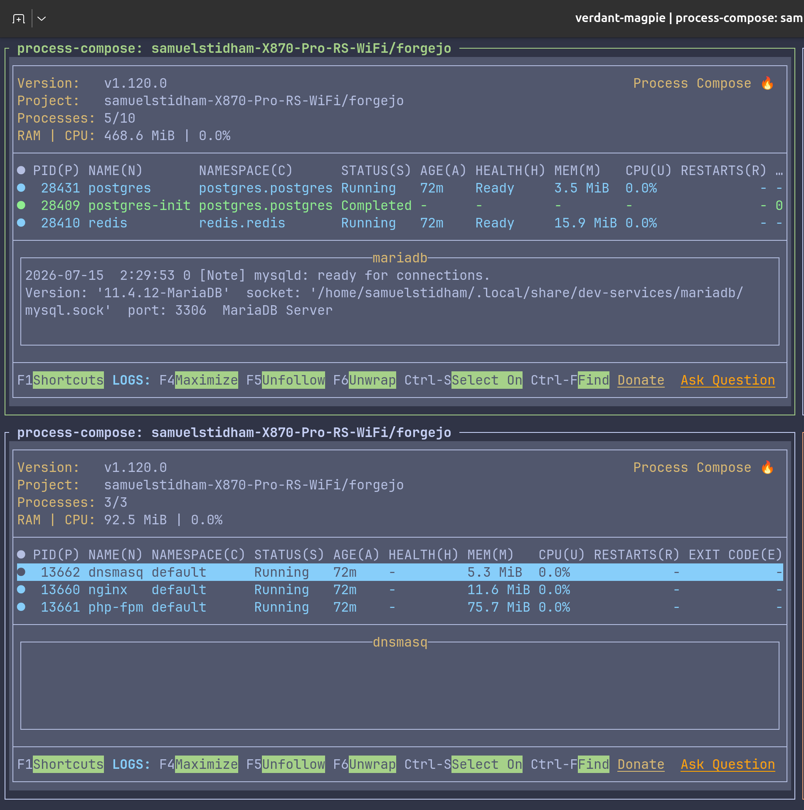

# The local dev stack

The Laravel Herd equivalent, built out of Nix. One command brings up every
database, cache, search index, object store, and the `*.test` web server.

Related: [commands.md](commands.md), [../SITES.md](../SITES.md)

---

## The one command

```bash
zellij -n servers --layout servers
```



Top pane is `services`, bottom is `sites`. Two free shells sit on the right, and
the top right one has focus so you land somewhere useful.

`-n servers` names the session. That matters: a second launch **attaches** to the
running session instead of starting a conflicting copy of every database. The
layout lives in `home/terminals.nix` and is rendered to
`~/.config/zellij/layouts/servers.kdl`.

Panes use `close_on_exit=false`, so a stack that crashes stays on screen with its
error instead of vanishing.

---

## Two stacks, run separately if you want

```bash
nix run .#services   # the data layer
nix run .#sites      # the web layer
```

Both are process-compose stacks, defined in `flake.nix`. They are split because
only `sites` needs port 80 and the DNS resolver setup, so `services` stays
portable and root free.

---

## services

Five come from [services-flake](https://github.com/juspay/services-flake), which
handles init, health checks, and data directories. Data lives under
`~/.local/share/dev-services/<name>`, so it survives a `home-manager switch`.

| Service | Package | Notes |
| --- | --- | --- |
| MariaDB | `pkgs.mariadb` | Socket at `~/.local/share/dev-services/mariadb/mysql.sock`, port 3306. |
| PostgreSQL | `pkgs.postgresql_18` | Pinned to 18. Has a `postgres-init` process that runs once then Completes. |
| Redis | default | |
| MongoDB | default | Unfree, allowed explicitly in `flake.nix`. |
| SeaweedFS | default | S3 gateway on 8333, filer on 8888. Dev credentials `dev` / `devsecret`, anonymous gets 403. Replaces MinIO, which nixpkgs marks abandoned. |

**Meilisearch is different.** It is not a services-flake service, so it runs as a
plain process-compose process:

```nix
settings.processes.meilisearch.command = ''
  meilisearch --db-path ~/.local/share/dev-services/meilisearch \
              --http-addr 127.0.0.1:7700
'';
```

So it has no services-flake health check or init step, and its port (**7700**) is
set directly in the command rather than through a module option. If it needs
tuning, edit the command, not a `services.*` block.

> A `Completed` status in the process list is not a failure. `postgres-init` is
> supposed to run once and exit. The header count (`5/10`) includes those.

### One unfree allowance

`flake.nix` sets `allowUnfree` for MongoDB. An `allowInsecurePredicate` for
MinIO lived here too. It left with MinIO, which nixpkgs marks abandoned by
upstream with unpatched CVEs. SeaweedFS replaced it and carries no such flag.

---

## sites

Two processes in this stack serve `~/sites/<name>` at `<name>.test`, plus nginx,
which is no longer one of them:

| Process | Role |
| --- | --- |
| **php-fpm** | PHP 8.5 over a unix socket, from `parts/php.nix`. The same PHP the CLI uses. |
| **dnsmasq** | Answers `*.test` on `127.0.0.1`, listening on port **5333**. |

**nginx moved out of this stack.** It is a systemd user service now, in
[home/web.nix](../home/web.nix), because it fronts Forgejo as well as the dev
sites and HTTPS to the git server cannot depend on this stack being started by
hand. See [docs/home-lab.md](home-lab.md).

That has one visible consequence. nginx is always up, so a dev site returns
**502** when this stack is down, rather than refusing the connection. That is the
honest answer: php is not running.

Every site also answers to `<name>.home.samuelstidham.me`, on a real certificate
and reachable from the MacBook. Same files, same nginx, no extra setup. `.test`
stays because it works with no internet at all.

### The document root driver

nginx picks the root per site, so different frameworks work with no config:

1. `public/` if present — Laravel, Symfony 4+, Bedrock
2. else `web/` — Symfony 2/3, older Drupal
3. else the site root — WordPress, plain PHP, static HTML

`index.php` is the front controller and static files fall through to
`index.html`. HTTP redirects to HTTPS **only if** a cert exists for that host in
the certs dir, so unsecured sites still work over plain HTTP.

Generate certs with `secure_sites` (defined in `home/fish.nix`). It writes a one
year self signed cert per `~/sites` folder. Re-run yearly or after adding a site.

### dnsmasq is why `.test` works

Port **5333** is deliberate: it avoids mDNS/avahi on 5353. systemd-resolved routes
`.test` there, which is a one time system setup documented in `SITES.md`.

**If `sites` is not running, `*.test` does not resolve.** Only names hardcoded in
`/etc/hosts` will. That is the usual cause of "`atlantis.test` worked yesterday
and not today" — the stack simply is not up.

---

## Paths that are pinned

`flake.nix` builds the dev-services state directory from a single `homeDir`
binding:

- `runDir = ${homeDir}/.local/share/dev-services`

The old `siteRoot` binding was deleted as dead. The sites root, `~/sites`, is
defined in `home/web.nix` now with `${config.home.homeDirectory}`. Moving
`~/sites` means editing that module.
